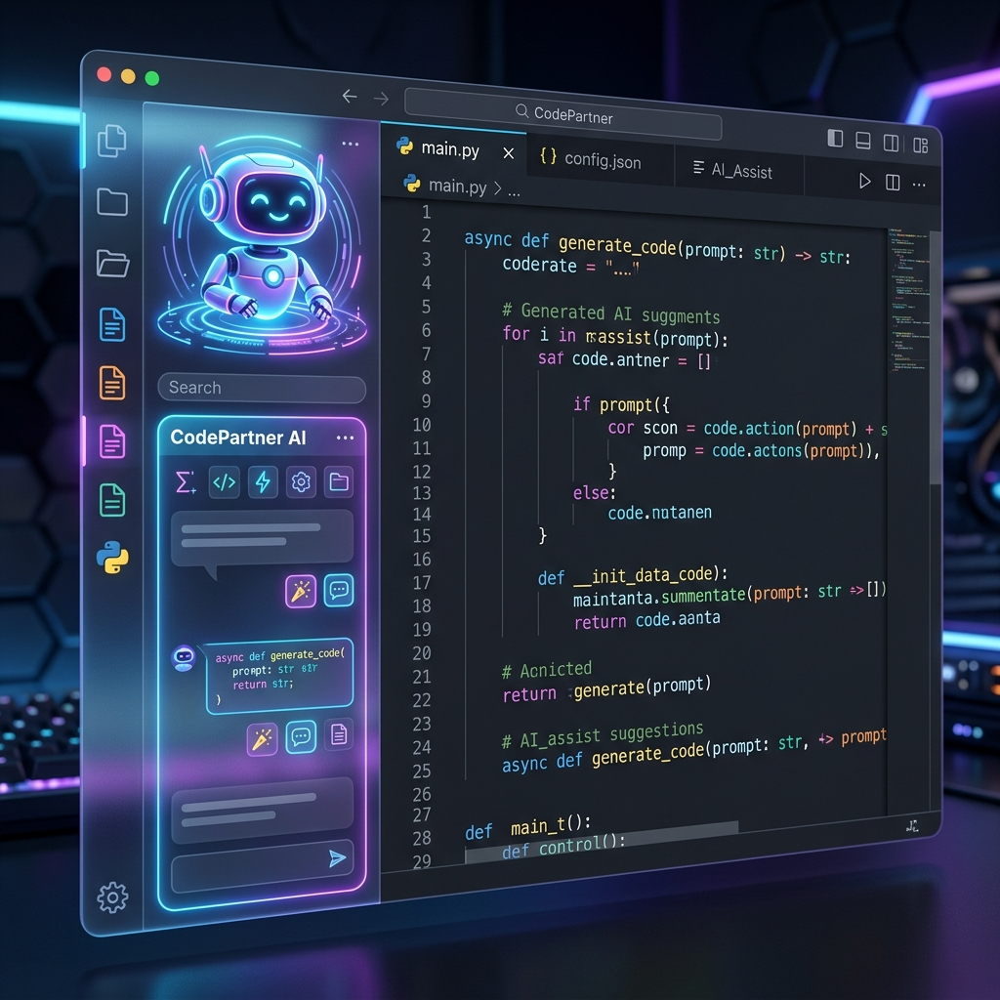

# CodePartner — The Premiere Agentic AI Coding Companion

**CodePartner** is a powerful, agentic AI co-pilot designed to transform how you build software. Unlike traditional chat extensions, CodePartner is built from the ground up with an "agent-first" philosophy—meaning it doesn't just suggest code; it plans, executes, and iterates on complex tasks directly in your workspace.

Whether you're refactoring a legacy codebase, building a new feature from scratch, or researching complex documentation, CodePartner is your autonomous partner in the editor.

---

## ✨ Why CodePartner?

In a world of simple "chat-with-file" extensions, CodePartner stands out by offering:

- **🎨 Premium Visual Experience**: A stunning, VS Code-native sidebar using modern glassmorphism design. It's not just a tool; it's a premium extension of your workflow.
- **⚡ Two Ways to Work**: 
  - **Fast Mode**: For quick questions, snippets, and bug fixes.
  - **Planning Mode**: For complex architectural changes. CodePartner will generate a full roadmap before touching a single line of code.
- **🧠 Reusable Skills**: Teach CodePartner your unique workflows. Save any set of instructions as a "Skill" and reuse it globally across all your projects.
- **🛠️ Safe & Precise Editing**: CodePartner uses advanced Search/Replace semantics. No more worrying about the AI overwriting your entire file with a partial snippet.
- **🌐 Autonomous Research**: Built-in browser control allows the AI to search the web, read documentation, and even take screenshots to verify UI changes.
- **📂 Content-Aware Search**: Mention `@workspace` and CodePartner will intelligently find the most relevant files by scanning contents, not just filenames.

---

## 🚀 Getting Started

CodePartner is designed to be up and running in seconds:

1. **Install**: Click the **Install** button on this Marketplace page.
2. **Configure**: Open VS Code Settings (`Ctrl+,`) and search for `CodePartner`.
   - Set your **API Provider** (`openai` or `azure`).
   - Enter your **API Key** and **Model ID** (e.g., `gpt-4o`).
3. **Open the Sidebar**: Click the CodePartner icon in the Activity Bar.
4. **Build**: Toggle to **Plan** mode and try asking: *"Refactor this project to use a modular structure and add unit tests."*

---

## ⚙️ Configuration Options

| Setting | Description |
| :--- | :--- |
| `codepartner.provider` | API provider (`openai`, `azure`) |
| `codepartner.apiEndpoint` | Your LLM endpoint URL |
| `codepartner.apiKey` | Your API authentication key |
| `codepartner.model` | The model ID or deployment name to use |
| `codepartner.maxTokens` | Maximum response length (default: 1024) |
| `codepartner.azureApiVersion` | Azure OpenAI API version (e.g., `2024-02-15-preview`) |
| `codepartner.azureDeployments` | List of Azure deployment names to show in the UI |

---

## 📦 Global Persistence

Your learned **Skills** and generated **Artifacts** are stored globally in `~/.codepartner`. This ensures that a skill you teach CodePartner in one project is immediately available in all your others.

## 📄 License

CodePartner is released under the [MIT License](https://github.com/AnandShah10/CodePartner/blob/master/LICENSE).

---
Developed with ❤️ by **AnandShah** — [GitHub](https://github.com/AnandShah10)
