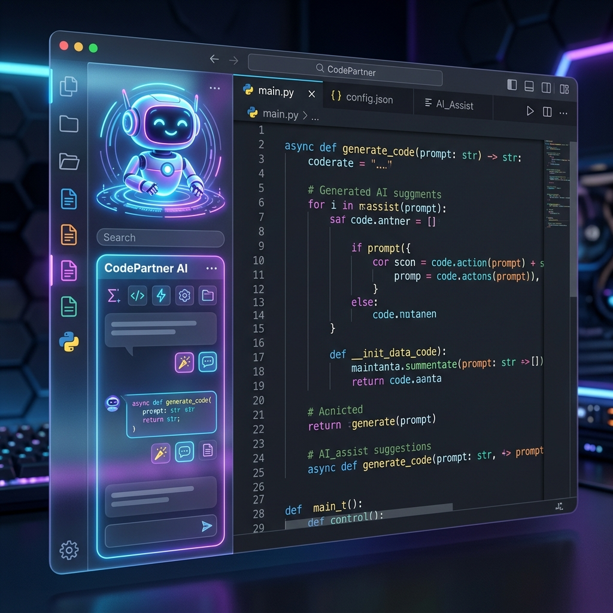

# CodePartner AI

**CodePartner AI** is a powerful **agentic** AI coding co-pilot that goes far beyond simple chat. Built with an "agent-first" philosophy, it autonomously plans, researches, edits code safely, runs commands, controls a browser, manages Git, and learns reusable **Skills** — all while following strict engineering best practices.

It supports **5 LLM providers** (OpenAI, Azure, Anthropic, Google, Ollama), **inline completions**, **MCP tools**, semantic search, multi-agent collaboration, and a beautiful glassmorphism UI with tabs for Plan, Timeline, Artifacts, and Skills.

---

## ✨ Key Features

### 🧠 Agentic Capabilities
- **Three Operating Modes**:
  - **Fast Mode**: Direct, concise responses and immediate actions
  - **Planning Mode**: Generates detailed implementation plans + artifacts; waits for approval before editing
  - **Architect Mode**: Drafts changes in-memory for review before bulk application
- **Multi-Agent System**: Automatically dispatches to specialized sub-agents (`researcher`, `code_expert`, `tester`, `writer`) running in **isolated Git worktrees** to enable safe, conflict-free concurrent editing
- **Proactive Skill Discovery**: Suggests saving repeated workflows as reusable global **Skills**
- **Timeline & Revert**: Full audit trail of every tool action with one-click undo

### 🛠️ Powerful Tools
- **Safe File Operations**: Always `read_file` first, precise hunk-based edits (`diffLines` + selective apply), `create_file`, `grep_search`
- **Approval & Safety**: Configurable policies (`always-ask` / `full-auto`), secret scanner, prompt injection guard
- **Terminal & Testing**: Runs shell commands, auto-detects and runs tests (`run_tests`)
- **Browser Control**: Navigate, click, type, screenshot web pages for research (cross-platform via Puppeteer)
- **Git Integration**: Status, stage, AI-generated commit messages (with Co-author), branches, and GitHub PR creation
- **Web & Knowledge**: DuckDuckGo search, document indexing (`index_docs` + `query_knowledge`)
- **MCP Support**: Connect to external Model Context Protocol servers for custom tools
- **Artifacts & Skills**: Persistent global storage (`~/.codepartner`) of code, plans, markdown, logs, and screenshots

### 🔍 Smart Context
- `@workspace` - **Semantic search** (TF-IDF by default; upgrade to real embeddings via `embeddingProvider` setting for dramatically better relevance)
- `@web` - Real-time web search + sub-agent researcher
- `@file` mentions and automatic context from active file + **all open tabs**
- Context compaction (LLM summarization when history >40 messages)
- Token-aware budgeting and truncation (shared across all sources)
- Image/file attachments support
- **New in v2.1.3**: Real embedding-based `@workspace` search via `embeddings.ts` (provider-agnostic for OpenAI/Azure/Google/Ollama, cosine similarity, chunking with overlap, content-hash caching, graceful TF-IDF fallback)

### 🎨 Premium UX
- Beautiful glassmorphism sidebar with tabs (Chat, Plan, Timeline, Artifacts, Skills)
- Inline ghost text completions (toggle with `Ctrl+Shift+I`)
- Diff views, apply/insert/copy actions on code blocks
- Model selector, mode switcher, chat history with rename/delete
- Feedback button for bugs/features

---

## 🚀 Quick Start

1. **Install** from the [VS Code Marketplace](https://marketplace.visualstudio.com/items?itemName=AnandShah.codepartner-ai)
2. **Configure API** (secure storage):
   - Run **"CodePartner: Set API Key"** from Command Palette (`Ctrl+Shift+P`). This stores your key securely via VS Code SecretStorage (migrates any old `settings.json` value automatically).
   - Then set:
     - `provider` (e.g. `openai`, `anthropic`, `ollama`)
     - `model` (e.g. `gpt-4o`, `claude-3-5-sonnet-20241022`, `llama3`)
   - Optional: tweak `approvalPolicy`, `contextTokenBudget`, `inlineCompletions`, etc.
3. **Open Sidebar**: Click the robot icon in Activity Bar or press `Ctrl+L` / `Cmd+L`
4. **Try it**:
   - **Fast**: "Explain this function"
   - **Plan**: Switch to Planning mode and ask "Add user authentication with JWT"
   - Use slash commands: `/fix`, `/explain`, `/test`

**Tip**: Use `@workspace` for project-wide awareness and `@web` for research.

---

## ⌨️ Commands & Keybindings

| Command | Title | Keybinding | Description |
|---------|-------|------------|-------------|
| `codepartner.focus` | Focus on Chat Sidebar | `Ctrl+L` / `Cmd+L` | Open the sidebar |
| `codepartner.toggleInlineCompletions` | Toggle Inline Completions | `Ctrl+Shift+I` / `Cmd+Shift+I` | Enable/disable ghost text |
| `codepartner.explainSelection` | Explain Selected Code | `Ctrl+Shift+;` / `Cmd+Shift+;` (when selection) | Context-aware explanation |
| `codepartner.fixErrors` | Fix Errors in File | `Ctrl+Shift+'` / `Cmd+Shift+'` | Auto-fix diagnostics |
| `codepartner.generateTests` | Generate Tests for File | `Ctrl+Alt+T` / `Cmd+Alt+T` | Create unit tests |
| `codepartner.newChat` | New Chat | `Ctrl+Alt+N` / `Cmd+Alt+N` | Start a fresh conversation |
| `codepartner.cancelActiveTask` | Cancel Active Task | `Ctrl+Alt+X` / `Cmd+Alt+X` | Stop any running agent/task |
| `codepartner.showDebugLog` | Show Debug Log | - | Open output channel |
| `codepartner.setApiKey` | Set API Key | - | Securely store LLM API key |

**Inline Completions**: `Ctrl+Right` (next word), `Ctrl+Alt+Right` (next line)

**Slash Commands in Chat**: `/fix`, `/explain`, `/test`, `/compact`, `/clear`, `/plan`, `/architect`

---

## ⚙️ Configuration

Key settings (full list in VS Code Settings → search "codepartner"):

| Setting | Default | Description |
|---------|---------|-------------|
| `codepartner.provider` | `openai` | LLM provider (`openai`, `azure`, `anthropic`, `google`, `ollama`) |
| `codepartner.embeddingProvider` | `disabled` | **New in v2.1.3**: Upgrade `@workspace` to real neural embeddings (`same-as-chat` / `openai` / `azure` / `google` / `ollama`). Defaults to zero-cost TF-IDF with automatic fallback on errors. |
| `codepartner.embeddingModel` | `` | Embedding model (blank = sensible default per provider) |
| `codepartner.embeddingEndpoint` | `` | Custom embeddings endpoint (blank = provider default) |
| `codepartner.apiKey` | `` | Set via **"CodePartner: Set API Key"** command (secure SecretStorage) |
| `codepartner.model` | `gpt-4` | Chat model / deployment name |
| `codepartner.apiEndpoint` | `https://api.openai.com/v1` | Custom chat endpoint |
| `codepartner.approvalPolicy` | `always-ask` | Safety (`always-ask` / `ask-for-shell` / `full-auto` / `yolo`) |
| `codepartner.contextTokenBudget` | `6000` | Shared token budget for file context, open tabs, and `@file` mentions |
| `codepartner.maxTokens` | `4096` | Max output tokens per response |
| `codepartner.inlineCompletions` | `false` | Enable ghost-text inline completions |
| `codepartner.inlineCompletionDebounce` | `500` | Debounce (ms) for inline suggestions |
| `codepartner.mcpServers` | `{}` | Custom Model Context Protocol tool servers |
| `codepartner.addAICoAuthor` | `true` | Add Co-authored-by to Git commits made by CodePartner |

**Tip for embeddings**: Start with `"same-as-chat"` (reuses your existing key/provider). Set to `disabled` to avoid any extra API cost/latency. See `embeddings.ts` for supported models and graceful fallback behavior.

---

## 📁 Global Persistence (`~/.codepartner`)

- **Skills**: Reusable instruction sets (`.md` files)
- **Artifacts**: Generated plans, code snippets, screenshots, logs
- **Knowledge**: Indexed documentation via `index_docs` + `query_knowledge`
- **Global Instructions**: `global_instructions.md` applied to every chat

Skills and knowledge travel with you across all projects.

---

## 📸 Screenshots

*(Screenshots will be added to the marketplace listing. Current assets in `/media`)*

- Glassmorphism Sidebar with multiple tabs
- Planning Mode with task tracker
- Timeline showing tool executions and revert options
- Artifact gallery with screenshots
- Inline completions in editor
- Diff review workflow

---

## 🔄 How It Works (Agent Rules)

CodePartner follows strict internal guidelines:
1. Always `read_file` before `edit_file`
2. Use exact text matching for search/replace
3. Create full, complete implementations (no truncated code)
4. In Planning Mode: Research → Create Plan Artifact → Wait for "proceed" → Execute → Verify with tests
5. Explains reasoning in responses
6. Uses markdown formatting

See full system prompt and tool definitions in `src/extension.ts`.

---

## 🤖 vs Other Tools

CodePartner excels in:
- **Broadest provider support** including local Ollama (no subscription required)
- **Global reusable Skills** and proactive suggestions
- **Browser automation** (unique vs Copilot)
- **Timeline with undo** and Architect drafting mode
- **Zero lock-in** — bring your own keys

For a detailed comparison (including gaps like inline completions in earlier versions), see [codepartner_comparison_analysis.md](codepartner_comparison_analysis.md).

**Note**: Now at **v2.1.5** — includes lint compliance (ESLint `curly` now an error), improved test runner stability (pinned VS Code version, higher timeouts, reduced flakiness), real **embedding-based semantic search** for `@workspace` (opt-in via `codepartner.embeddingProvider`, with automatic graceful TF-IDF fallback), full unit tests, durable Timeline undo, Architect hunk review, MCP, context compaction, approval policies, and all prior v2.1.x improvements. See [CHANGELOG.md](CHANGELOG.md) for details.

---

## 📄 License

This project is licensed under the [MIT License](LICENSE).

---

**Developed with ❤️ by [AnandShah](https://github.com/AnandShah10)**

[GitHub Repository](https://github.com/AnandShah10/CodePartner) | [Report Issue](https://github.com/AnandShah10/CodePartner/issues) | [Marketplace Page](https://marketplace.visualstudio.com/items?itemName=AnandShah.codepartner-ai)

---

**Happy Coding!** Try asking CodePartner to "build a full-featured todo app with tests" in Planning mode.
